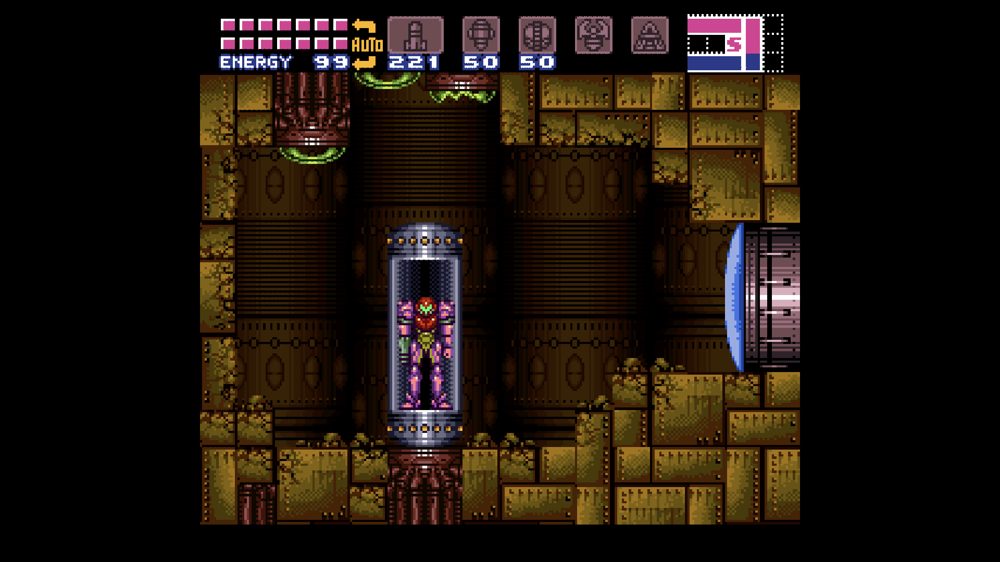
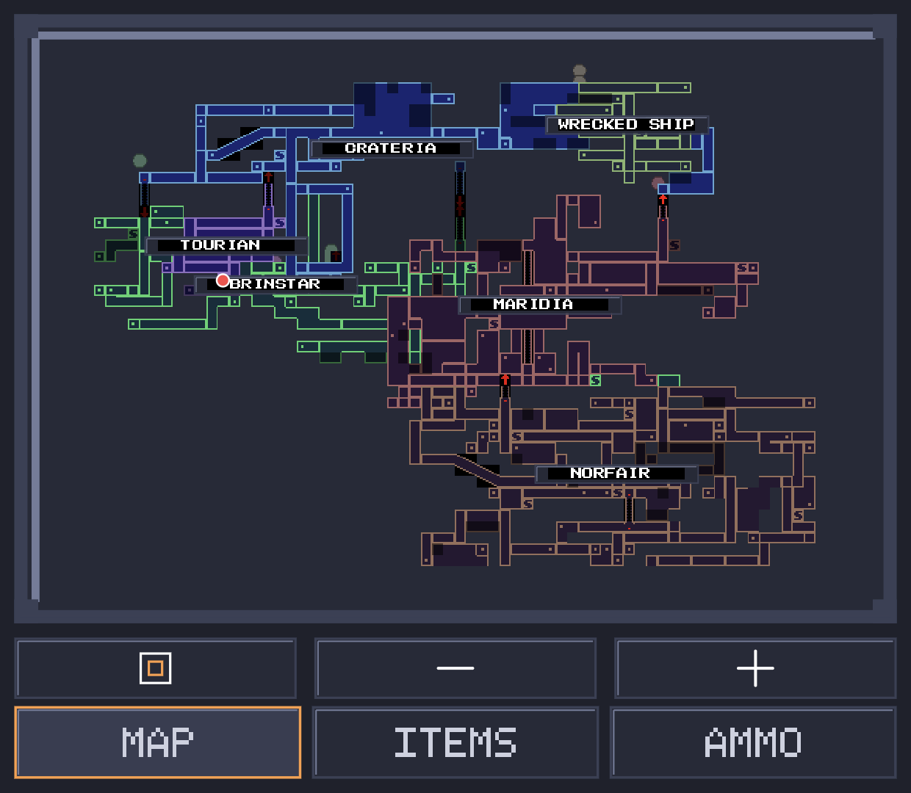
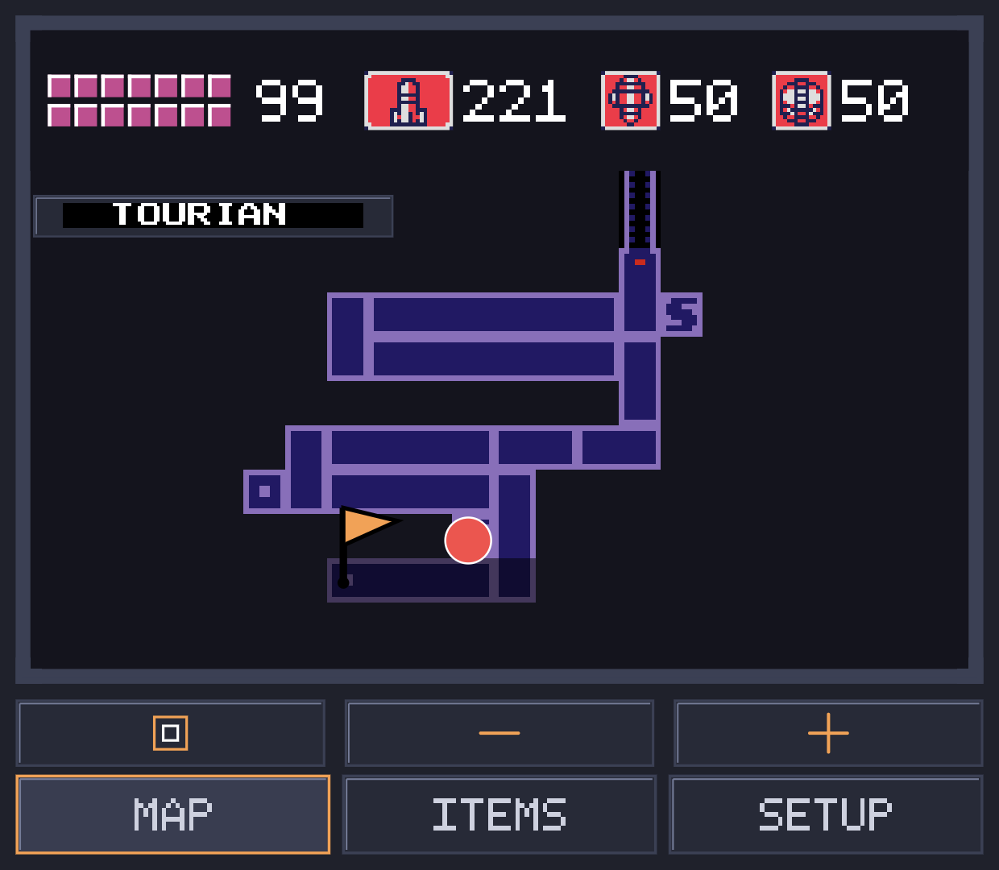
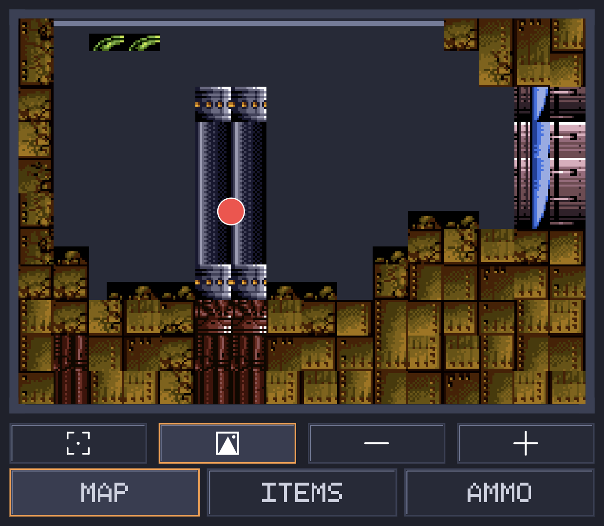
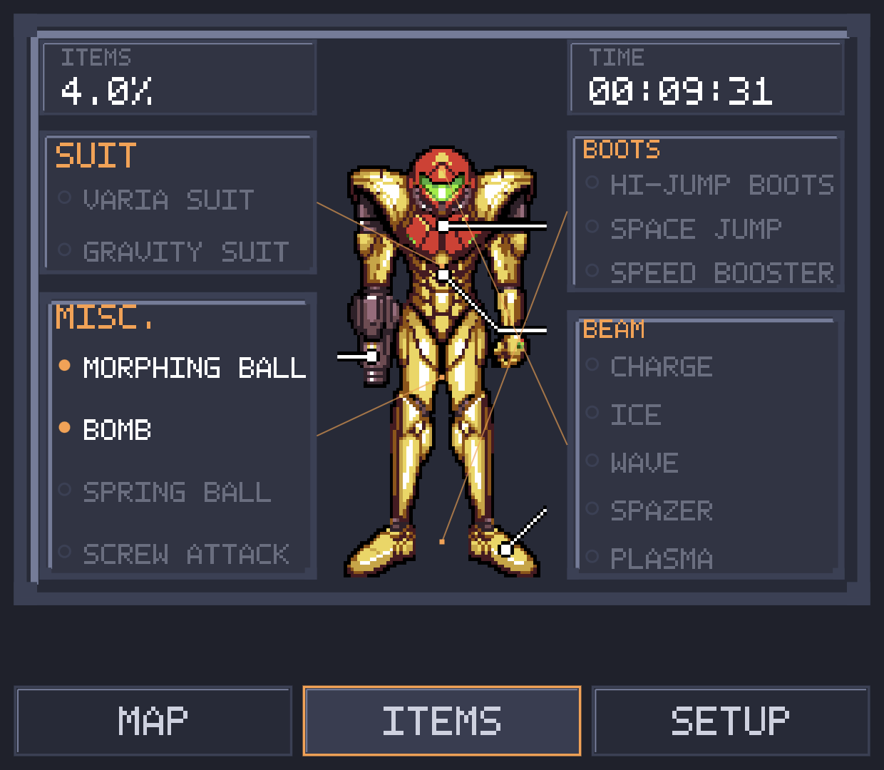
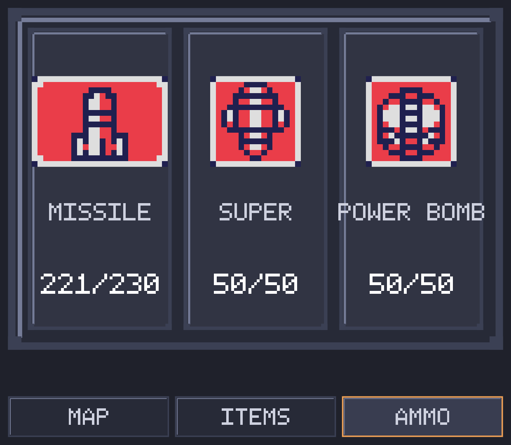

# Super Metroid Android SNES emulator (with dual-screen support)

An Android SNES emulator for Super Metroid, with a second-screen mod for
dual-display handhelds like the AYN Thor. While you play on the main screen,
the second panel shows a live map, your equipment, and your ammo, so you
don't have to pause and dig through menus to check where you are or what
you're carrying.

This is built on top of [snesrev/sm](https://github.com/snesrev/sm), a C
decompilation of Super Metroid, which bundles both a from-scratch
reimplementation of the game's logic in C *and* a byte-accurate 65816 CPU +
SPC-700 APU emulator core (normally used only to verify the decompile
matches real hardware, frame by frame). Gameplay here runs on that second
part - the real emulator core, executing the actual ROM's original machine
code - not on the decompiled C logic. That switch was made after finding a
real mistranslation bug in the decompile that only manifested on Android's
arm64 target (never on desktop/x86_64, and never on real hardware), causing
a softlock in a specific room. Running on the real emulator core sidesteps
that whole class of bug, at the cost of losing the one gameplay tweak (see
below) that was implemented as a decompiled-C hook rather than a RAM-level
edit.

This follows the same idea as [samyost1/zelda3-android](https://github.com/samyost1/zelda3-android)'s
dual-screen mod for `snesrev/zelda3`, adapted for Super Metroid's own map and
item system.

| Main screen | Second screen: world map |
|---|---|
|  |  |

| Second screen: single room, schematic | Second screen: single room, real texture |
|---|---|
|  |  |

The real-texture room view (right, above) is still in development. It is
usable now, you can clearly tell where you are and where everything is,
but it currently has graphical glitches (visible in the screenshot on the
right edge of the room). It will get cleaned up over time.

| Second screen: items | Second screen: ammo |
|---|---|
|  |  |

The underlying decompile is still an early-stage project, and its C game
logic remains in this codebase (used on desktop/Switch builds, and always
available as a reference for the emulator core to be checked against), but
it is not what drives gameplay in the Android build. See the
[original repo](https://github.com/snesrev/sm) and its
[Discord](https://discord.gg/AJJbJAzNNJ) for the state of the decompile
effort itself. This fork does not modify the ROM's own game logic; the
ammo-cycle shortcut listed below is implemented as a RAM edit from the
platform layer, not as a change to gameplay code. Everything else is
additive: the Android platform target and the second-screen mod.

## About the development of this port

I built this with help from Claude (Anthropic's AI). I want to be upfront
about that instead of leaving it a surprise.

I have a bachelor's degree in computer science and engineering and work as
a software engineer, so I can read and write code fine. Game development
specifically, and reverse-engineered SNES decompilation code in particular,
is not my background. I wrote and modified parts of this myself, and for
the rest, when I got stuck or ran into something outside what I knew (a
crash coming from deep in the SNES PPU emulation, or how the game's own
door/room graph needed to be walked to lay out a correct world map), I
used Claude to work through it with me rather than spend days learning an
unfamiliar codebase from scratch. That is what the AI assistance in this
project actually was: a way to move faster on the parts I did not already
know, not a replacement for understanding what I was building.

Every feature went through real back and forth. I made the design calls:
what the second screen should show, how the map should behave, what the
item screen should look like. I tested everything myself on real hardware,
reported back what was broken or wrong, often in detail since "the map
looks wrong" is not enough for anyone, human or AI, to fix a rendering bug,
and went through many rounds of that per feature. Bugs that only show up in
actual play (a room that crashes on a specific save, a suit color that
does not match what is actually equipped) cannot be found by just reading
code, so this took real hands-on debugging on my end, on top of whatever
code got written.

## Legal

No game assets are included anywhere in this repository or shipped in the
built app. You need your own legally-dumped copy of the ROM
(`sm.smc`/`.sfc`) to build or run this on any platform. The app reads
graphics, audio, and level data from your ROM at runtime, the same way the
original hardware did.

## Android

### Requirements
- Android Studio with the NDK installed (tested with NDK 27)
- Your own Super Metroid ROM

### Building
```sh
cd android
./gradlew assembleDebug
```
Install the resulting APK (`android/app/build/outputs/apk/debug/app-debug.apk`)
on your device. On first launch, it prompts you to pick your ROM file. It
gets copied into the app's private storage, never bundled or shared.

### Dual-screen mod

On a device with a second physical display (e.g. the AYN Thor), the second
screen shows automatically once you're in-game, with three tabs along the
bottom:

**Map** tab. Two modes, toggled with the picture-frame button:
- Schematic mode: the real in-game pause-menu map tiles, decoded straight
  from your ROM, not a hand-drawn placeholder. Pinch or use the +/- buttons
  to zoom from a single room out to the full connected world map, and pan
  around with a drag. Only areas and rooms you've actually explored are
  shown, matching the real game's own reveal-as-you-go rule.
- Real-texture mode: the actual room background art (walls, floor,
  decoration) instead of schematic rectangles, for the room you're
  currently standing in. Also explored-only, and clipped to the room's real
  pixel bounds. Still in development: usable and clear, but it currently
  has some graphical glitches (see the screenshot above).

  The world map's area layout (where Crateria sits relative to Brinstar,
  Norfair, and so on) is not eyeballed. It's derived from every real
  inter-area door in the ROM: 32 doors, 16 unique connections, walked
  through the game's own room and door data (room coordinates and each
  door's destination room and landing point). Each door gives one hard
  constraint (this point in area A's map has to line up with this point in
  area B's map), and all 16 are satisfied by anchoring each area to one
  real door connection to an already-placed neighbor, starting from
  Crateria and working outward. The full derivation lives in
  `WORLD_AREA_LAYOUT` and `WORLD_CONNECTORS` in `MapStatusView.java`, with
  the reasoning in the comments above them. Some real overlap between
  areas remains (Zebes' room data was authored independently per area and
  genuinely doesn't tile edge to edge), which is expected and harmless
  since only explored pixels are ever drawn.

**Items** tab. Your currently equipped suit, boots, beams, and misc items,
shown as a list next to a full-color Samus sprite with callout lines to
each equipped item. The suit art (tile graphics, palette, and layout) was
extracted from a build of the [Super Metroid Redux ROM hack](https://github.com/ShadowOne333/Super-Metroid-Redux) and is used here
for the same equipment-screen purpose it was originally drawn for, recolored
live to match whichever suit you actually have equipped (Power, Varia, or
Gravity). Credit to that hack's artists for the original graphics; if you
maintain that project and would rather this not be included, open an issue
and I'll take it out.

**Ammo** tab. Tap a missile, super missile, or power bomb slot to arm it,
the same effect as pressing Select on the controller until you reach it.
Tap the already-armed slot again to disarm it back to your plain beam.

### Controls

Gamepad input works out of the box. On the Thor specifically:
- A/B are remapped to match its Nintendo-style physical layout (see
  `main.c`'s `__ANDROID__` guard in `RemapSdlButton`, since SDL's
  controller database doesn't have an entry for this device yet).
- L2/R2 cycle your armed ammo type without needing to open the second
  screen's Ammo tab. This device reports L2/R2 as plain digital buttons
  rather than analog triggers, so they're read directly in
  `MainActivity.dispatchKeyEvent` instead of through the normal gamepad
  path.

Quicksave/quickload (useful for testing without replaying long stretches):
hold L1+R1 and press Start to save, Back/Select to load. Bound via
`android/app/src/main/assets/sm.ini`, since the desktop build's F1-F10
quicksave keys aren't reachable from a gamepad-only device.

### Gameplay tweaks

- **Auto-run**: currently disabled. It previously worked by patching the
  decompiled C game logic, which no longer runs gameplay on Android (see
  above) - `AutoRun` in `sm.ini` has no effect right now. Vanilla
  hold-to-run behavior is what you get. Re-adding it needs an
  emulator/input-layer equivalent instead of a decompile-side hook.

## Desktop / Switch

The original platforms this decompile supports (Windows, Linux/macOS,
Nintendo Switch) still build the same way as upstream. See
[BUILDING.md](BUILDING.md).
